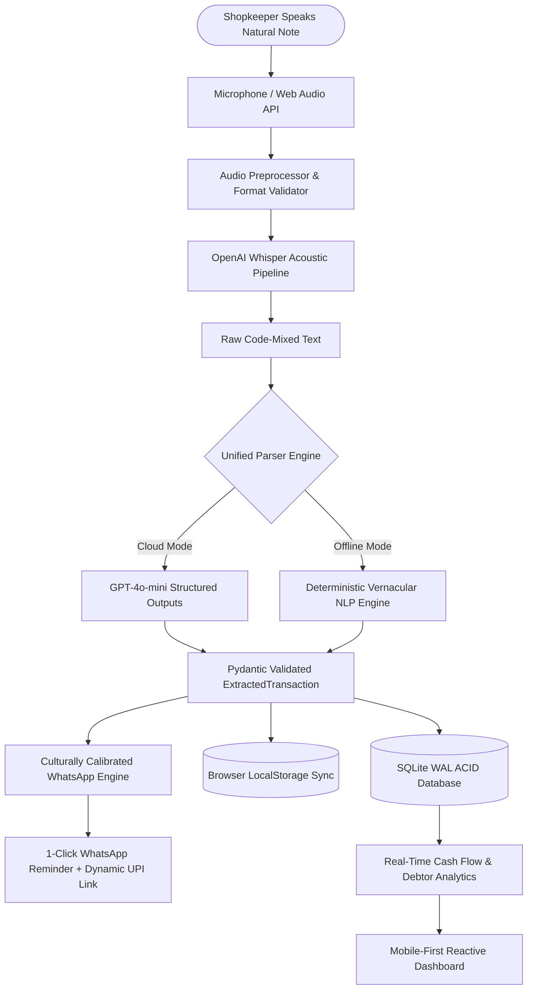

# 🎙️ LikhLo AI

> **"Bhaiya, Likh Lo!" • Voice-First AI Khata & Ledger Copilot for 63M+ Micro-Merchants**  
> *Built from real competitive teardowns (Khatabook, OkCredit, Vyapar App). Zero typing. Zero bloat. 100% offline resilient.*

[](https://opensource.org/licenses/MIT)
[](https://www.python.org/)
[](https://fastapi.tiangolo.com/)
[](https://sqlite.org/)
[](https://openai.com/)

---

## 💡 The Real Problem Solved

Every day across India, over **63 million micro-merchants and kirana shopkeepers** hear the exact same sentence at their billing counters:

> *"Bhaiya, likh lo!"* *(Brother, write it down in my credit book!)*

And every day, merchants face the same painful breakdown:
1. **Typing Friction During Peak Rushes:** Shopkeepers cannot stop to type names, amounts, and items on small touchscreens while handling physical inventory and customer lines. 10% to 15% of transactions are scribbled on loose paper chits that get lost.
2. **"Ghost" Udhaar Disputes:** Weeks later when a customer arrives to settle their debt, they dispute lump-sum amounts (*"I never took ₹850!"*). Because existing apps only capture lump sums without line items, neighborhood trust is damaged.
3. **Robotic, Destructive Reminders:** Competitors send sterile, automated debt collection SMS messages that read like bank recovery agents, offending loyal customers who take their business elsewhere.
4. **Cloud Monopolies & Sync Freezes:** Patchy network connectivity in basement shops freezes app sync queues, causing lost entries and double-counting.

---

## 🥊 Competitive Teardown & Root Cause Analysis (RCA)

| Dimension | Khatabook | OkCredit | Vyapar App | LikhLo AI |
| :--- | :--- | :--- | :--- | :--- |
| **Data Entry** | Manual keypad typing (4-6 taps/entry) | Manual keypad typing (3-5 taps/entry) | Desktop/mobile invoice forms (10+ fields) | **Voice-First (5-second speech, 0 taps)** |
| **Voice Processing** | None / basic search | None | None | **Code-mixed Indian vernacular acoustic parsing** |
| **Itemized Tracking** | Hidden behind complex invoice screens | None (lump-sum only) | Full SKU invoice dropdowns | **Auto-extracted goods & quantities from speech** |
| **Payment Reminders** | Robotic, generic SMS/WhatsApp | Aggressive loan/debt collection alerts | Generic WhatsApp invoice link | **3 culturally calibrated vernacular tones + dynamic UPI** |
| **Offline Resilience** | Patchy; sync conflicts in poor connectivity | Requires active internet for updates | Local desktop DB, but mobile sync breaks | **Offline-first SQLite WAL + LocalStorage dual engine** |
| **Bloat & Privacy** | Heavy NBFC loan cross-selling & popups | Third-party loan collection spam | Expensive annual subscription (₹2,500+) | **Zero bloat, open-source MIT utility** |

---

## 📐 System Architecture



---

## ✨ What LikhLo AI Delivers

* **5-Second Hands-Free Voice Ingestion:** Tap the mic and speak naturally in Hindi, Hinglish, or English:
  > *"Sharma ji ko 5kg atta aur 2 packet doodh udhaar diya, 280 baki hai, somvaar denge"*
* **Automatic Itemization Without Invoice Forms:** Captures both the aggregate amount AND itemized line items (*Atta 5kg, Milk 2 pkt*) so credit disputes never happen.
* **Culturally Calibrated Vernacular Reminders:** Generates 3 relationship-preserving tones (Polite & Respectful, Friendly/Casual, Formal Ledger) in natural conversational Hinglish.
* **1-Click Dynamic UPI Payment Links:** Automatically calculates and embeds standard NPCI UPI links (`upi://pay?pa=...&am=...`) directly inside WhatsApp messages.
* **Offline-First Resilience:** Functions 100% out of the box using built-in deterministic NLP heuristics without requiring an internet connection or OpenAI API key.
* **Zero Bloat & 100% Data Ownership:** No predatory loan popups, no invasive phonebook permissions, and full CSV export for accountants and tax filings.

---

## 🚀 Quickstart

### 1. Clone the Repository
```bash
git clone https://github.com/akanshasingh/likhlo-ai.git
cd likhlo-ai
```

### 2. Set Up Virtual Environment & Dependencies
```bash
python -m venv .venv
source .venv/bin/activate  # On Windows: .venv\Scripts\activate
pip install -r requirements.txt
```

### 3. Run the Application
```bash
python -m uvicorn likhlo_ai.server:app --host 127.0.0.1 --port 8000 --reload
```

Open your browser at `http://127.0.0.1:8000` to interact with the full dashboard!

---

## 🧪 Automated Test Suite

LikhLo AI comes with comprehensive test coverage across the database, heuristic NLP, UPI link generation, FastAPI endpoints, and security edge cases:

```bash
python -m unittest discover tests -v
```

All tests run locally in milliseconds without requiring external API keys.

---

## 📂 Project Structure

```text
likhlo-ai/
├── likhlo_ai/                 # Core Python Backend Package
│   ├── __init__.py
│   ├── config.py             # Settings with pydantic-settings
│   ├── database.py           # SQLite connection with WAL mode
│   ├── models.py             # SQLAlchemy ORM models
│   ├── schema.py             # Pydantic v2 schemas
│   ├── parser/
│   │   ├── __init__.py
│   │   ├── heuristic.py      # Indian retail vernacular NLP rule engine
│   │   ├── llm.py            # OpenAI Structured Outputs parser
│   │   └── engine.py         # Unified parser with automatic fallback
│   ├── voice/
│   │   ├── __init__.py
│   │   ├── audio_utils.py    # Audio file validation & format checks
│   │   └── transcriber.py    # Whisper speech transcription wrapper
│   ├── reminders/
│   │   ├── __init__.py
│   │   ├── upi.py            # NPCI UPI deep-link generator
│   │   └── whatsapp.py       # Culturally calibrated reminder messages
│   ├── api/
│   │   ├── __init__.py
│   │   ├── routes_transactions.py # Transaction CRUD & settlement
│   │   ├── routes_voice.py        # Voice upload & transcript endpoints
│   │   ├── routes_reminders.py    # WhatsApp message & UPI generation
│   │   ├── routes_analytics.py    # Cash flow, debtor breakdown, daily summary
│   │   └── routes_export.py       # CSV and JSON ledger export endpoints
│   └── server.py             # FastAPI entrypoint with CORS & static mounting
├── frontend/                  # Web Dashboard
│   ├── index.html            # Accessible mobile-first HTML interface
│   ├── styles.css            # Vanilla CSS design system
│   └── app.js                # Web Audio, LocalStorage, & UI handlers
├── tests/                     # Automated Test Suite
│   ├── test_database.py      # SQLite database transactions & cascades
│   ├── test_heuristic.py     # 20+ code-mixed voice test scenarios
│   ├── test_upi.py           # UPI link parameters & encoding
│   ├── test_api.py           # FastAPI endpoints validation
│   └── test_edge_cases.py    # Corrupt audio, empty inputs, SQL injection
├── requirements.txt           # Python dependencies
├── LICENSE                    # MIT Open Source License
└── README.md                  # Project documentation
```

---

## 👤 Author

**Akansha Singh**  
Product Marketing & Brand Strategist | AI & Consumer Intelligence  
*Ex-Zomato | Seth M. R. Jaipuria Schools*  
LinkedIn: [linkedin.com/in/akanshasinghurl](https://www.linkedin.com/in/akanshasinghurl)

---

## 📄 License

This project is licensed under the MIT License. See the [LICENSE](LICENSE) file for details.
